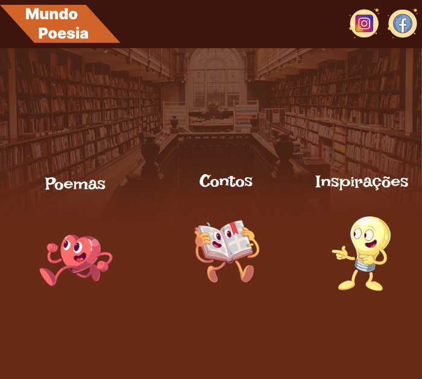

# Projeto Mundo Poesia

> Pequeno projeto amador que estou desenvolvendo

Estou trabalhando em um site por conta própria que pretendo usar para colocar meus textos (poemas/contos/entre outros). 😁

🔗 Link do site [AQUI](https://wendersonvibes.github.io/mundo-poesia/) 🔗

## 👨‍💻 Tecnologias usadas 👨‍💻
- HTML
- CSS
- Git
- GitHub

## ☎ Contato
- wenderson1909@gmail.com
- [Meu instagram](https://www.instagram.com/wenderson_da_silva07/)

Aceito ajuda e sugestões de como estruturar o HTML e CSS.

[🔗Clique aqui para ver o layout do meu site](https://www.figma.com/file/cIJj7zdHsdM85fZoXW6Xa5/Mundo-Poesia?node-id=0%3A1)

